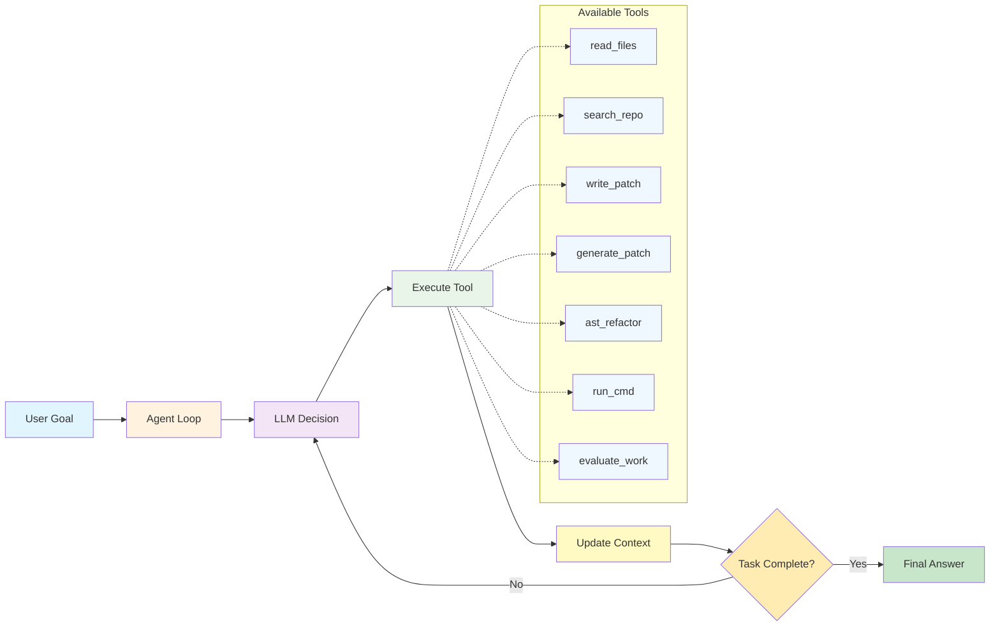
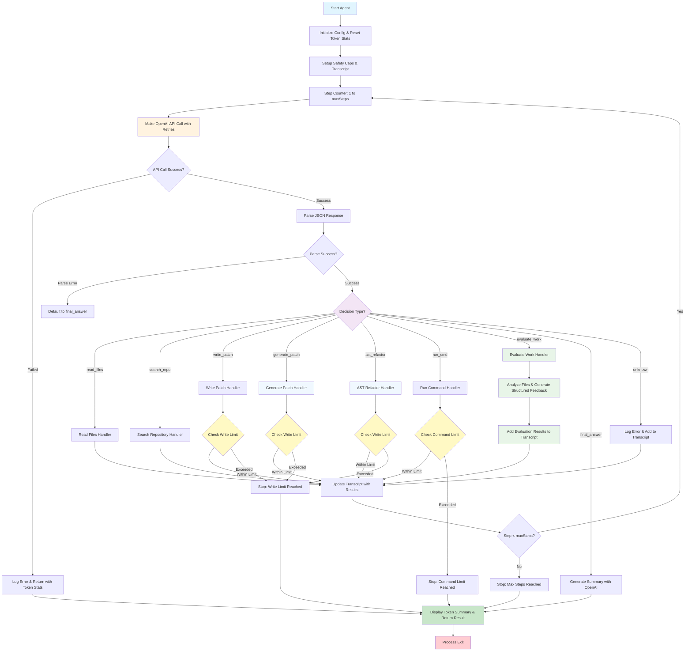

# Agent Loop - Coding Agent

## Overview

This project is a simple coding agent implemented with an Agent Loop architecture.

It runs OpenAI LLM calls in a loop and depending on the response, it can read files, search the repo, write patches, run commands, and evaluate work quality. The agent continues this loop until it reaches a final answer or a maximum number of iterations.

## Key Features

- **Manual Tool Calls**: Uses manual tool calls instead of OpenAI function calling for more control
- **Dual Patch Formats**: Supports both full-file patches (for new files) and unified diff patches (for incremental improvements)
- **AST-Based Refactoring**: Advanced TypeScript refactoring using the TypeScript compiler API for symbol renaming, import management, and structural changes
- **Structured Patch Generation**: Generate precise patches from natural language instructions with line-specific edits
- **Work Evaluation**: Built-in evaluation tool that analyzes created files and provides structured feedback with scores, strengths, improvements, and specific suggestions
- **Diff Parsing**: Unified diff patch parsing with comprehensive error handling
- **Iterative Workflow**: Agent follows a structured workflow: create → evaluate → improve with diff patches → re-evaluate

## Tools Available

1. **read_files**: Read and analyze existing files
2. **search_repo**: Search the repository for patterns or content
3. **write_patch**: Apply patches in unified diff format (preferred) or full-file format
4. **generate_patch**: Generate structured patches from natural language instructions
5. **ast_refactor**: Perform AST-based refactoring operations using TypeScript compiler API
6. **run_cmd**: Execute shell commands
7. **evaluate_work**: Analyze files and provide structured feedback for improvements
8. **final_answer**: Complete the task and generate a summary

## High-Level Agent Loop



## Detailed Architecture Diagram



## CLI Usage

### Installation

Install globally to use from anywhere on your system:

```bash
npm install -g .
```

If you need extra permissions, then:

```bash
chmod +x <path>/agent-loop/dist/src/cli.js
```

Then you can run it with:

Or use directly without installation:

```bash
npx agent-loop
```

### Basic Usage

Run the CLI in interactive mode:

```bash
agent-loop
```

Or provide a prompt directly:

```bash
agent-loop --prompt "Create a simple HTML page with CSS styling"
```

### CLI Options

```bash
agent-loop [options]

Options:
  -p, --prompt <prompt>           Direct prompt to execute (skips interactive mode)
  -m, --max-steps <number>        Maximum number of steps to execute (default: 20)
  -w, --max-writes <number>       Maximum number of file writes (default: 10)
  -c, --max-commands <number>     Maximum number of commands to run (default: 20)
  --no-console-log                Disable console logging
  --file-log                      Enable file logging
  --log-file <path>               Log file path (default: agent-log.txt)
  --test-command <command>        Test command to run (default: npm test --silent)
  --test-args <args>              Test command arguments (comma-separated)
  -h, --help                      Display help for command
  -V, --version                   Display version number
```

### Examples

```bash
# Interactive mode
agent-loop

# Direct prompt
agent-loop --prompt "Create a React component for a todo list"

# With custom limits
agent-loop --prompt "Build a calculator app" --max-steps 30 --max-writes 15

# With custom test command
agent-loop --prompt "Create a Node.js API" --test-command "npm" --test-args "test,run"

# With file logging
agent-loop --prompt "Create a website" --file-log --log-file my-agent.log
```

## Environment Variables:

- OPENAI_API_KEY : Your OpenAI API key (required)
- AGENT_CONSOLE_LOGGING=false : Disable console logging (default: true)
- AGENT_FILE_LOGGING=true : Enable file logging (default: false)
- AGENT_LOG_FILE=path/to/log : Log file path (default: agent-log.txt)

## Installation

```bash
npm install
npm start
```


