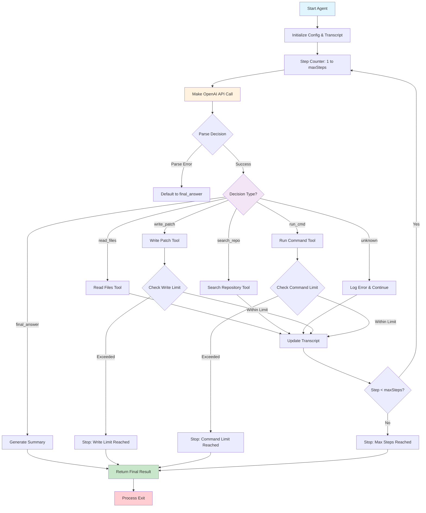

# Agent Loop - Coding Agent

## Overview

This project is a simple coding agent implemented with an Agent Loop architecture.

It runs OpenAI LLM calls in a loop and depending on the response, it can read files, search the repo, write patches, and run commands. The agent continues this loop until it reaches a final answer or a maximum number of iterations.

This uses manual tool calls instead of using the OpenAI function calling feature, allowing for more control over the process.

## Architecture Diagram



## Environment Variables:

- OPENAI_API_KEY : Your OpenAI API key (required)
- AGENT_CONSOLE_LOGGING=false : Disable console logging (default: true)
- AGENT_FILE_LOGGING=true : Enable file logging (default: false)
- AGENT_LOG_FILE=path/to/log : Log file path (default: agent-log.txt)

## Installation

```bash
npm install
npm start
```
