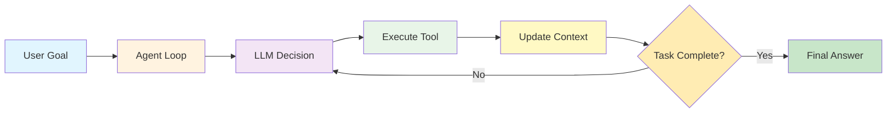
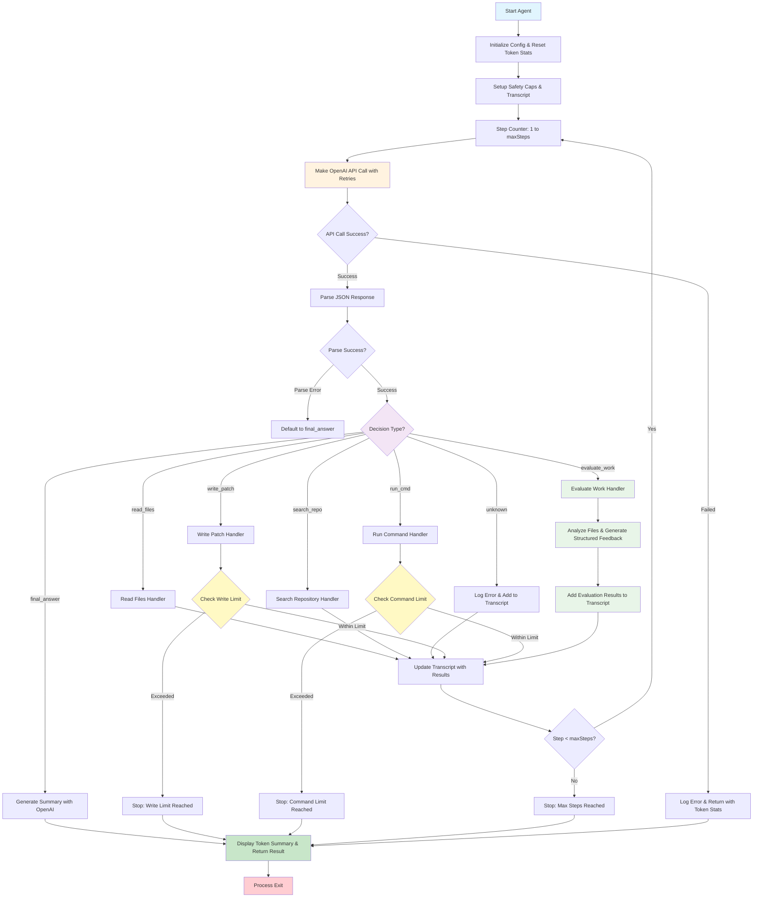

# Agent Loop - Coding Agent

## Overview

This project is a simple coding agent implemented with an Agent Loop architecture.

It runs OpenAI LLM calls in a loop and depending on the response, it can read files, search the repo, write patches, run commands, and evaluate work quality. The agent continues this loop until it reaches a final answer or a maximum number of iterations.

## Key Features

- **Manual Tool Calls**: Uses manual tool calls instead of OpenAI function calling for more control
- **Dual Patch Formats**: Supports both full-file patches (for new files) and unified diff patches (for incremental improvements)
- **Work Evaluation**: Built-in evaluation tool that analyzes created files and provides structured feedback with scores, strengths, improvements, and specific suggestions
- **Robust Diff Parsing**: Enhanced diff patch parsing with fallback mechanisms for edge cases
- **Iterative Workflow**: Agent follows a structured workflow: create → evaluate → improve with diff patches → re-evaluate

## Tools Available

1. **read_files**: Read and analyze existing files
2. **search_repo**: Search the repository for patterns or content
3. **write_patch**: Apply patches in unified diff format (preferred) or full-file format
4. **run_cmd**: Execute shell commands
5. **evaluate_work**: Analyze files and provide structured feedback for improvements
6. **final_answer**: Complete the task and generate a summary

## High-Level Agent Loop



## Detailed Architecture Diagram



## Environment Variables:

- OPENAI_API_KEY : Your OpenAI API key (required)
- AGENT_CONSOLE_LOGGING=false : Disable console logging (default: true)
- AGENT_FILE_LOGGING=true : Enable file logging (default: false)
- AGENT_LOG_FILE=path/to/log : Log file path (default: agent-log.txt)

## Installation

```bash
npm install
npm start
```
